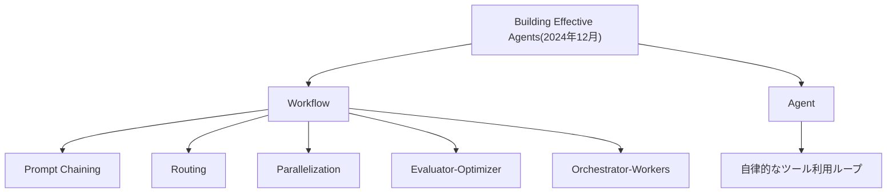
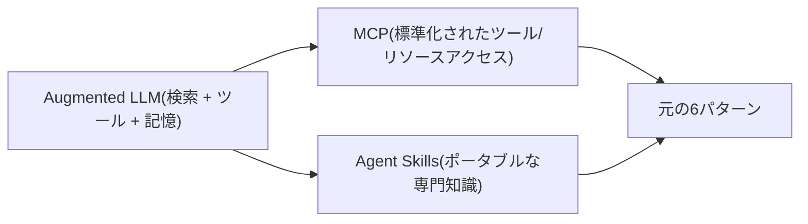

2024年12月、Anthropicは["Building Effective Agents"](https://www.anthropic.com/engineering/building-effective-agents)という短いエンジニアリング記事を公開した。当時すでに広がりすぎて掴みどころのなくなっていた「エージェント」というテーマに、小さく精密な語彙を与えたという点で異例の記事だった。5つの組み合わせ可能なWorkflowパターン(Prompt Chaining、Routing、Parallelization、Evaluator-Optimizer、Orchestrator-Workers)と、LLM自身がツール呼び出しと環境からのフィードバックのループの中で制御フローそのものを決める、本当の意味でのAgentパターンが1つ。

あれから1年半が経った。その間にエコシステムは猛スピードで動いた。Model Context Protocolが登場し事実上の標準になり、ClaudeにSkillsとcomputer useが加わり、十数個のエージェントフレームワークが登場してはいくつか静かに消えていき、そしてAnthropic自身が発表した2026年のデータによれば、企業の半数以上がすでに本番環境でエージェントを稼働させている。この状況を踏まえると、当然こう問いたくなる——あの当初のタクソノミーは今も実務家の思考の土台になっているのか、それとも静かに置き換えられてしまったのか。

ローカルのOllamaモデルに対して6パターンすべてを実装するハンズオンリポジトリ——[ai-architecture-pattern](https://github.com/qameqame/ai-architecture-pattern)——を作り、その過程でEvaluator-Optimizerスクリプトの実際のバグにも遭遇した身として、私の答えは「イエス、今も通用する」だ。ただし、どう通用しているか(そして通用しない部分がどこか)は具体的に見ておく価値がある。

この記事全体の土台になっているタクソノミーはこちら——5つの組み合わせ可能なWorkflowパターンと、本当の意味でのAgentパターンが1つ。

## タクソノミーは今も参照点であり続けている

あるフレームワークが定着した最も明確なサインは、人々がそれを称賛していることではなく、他の人々がそれを置き換えるのではなく、その上に積み上げ続けていることだ。まさにそれが起きている。2026年のarXivのエージェント設計パターンに関するサーベイ論文は、Anthropicの2024年12月の記事を「エージェントパターン文献の中で最も引用されているタクソノミー」と表現し、それを破棄するのではなく、2つの新しい軸(認知機能と実行トポロジー)に沿って拡張している——元の「5+1」を叩き台としてではなく、積み上げるべき土台として扱っているわけだ。2026年に公開された複数のパターンカタログ(AgentPatterns.ai、BuildingEffectiveAgents.com、いくつかの企業エンジニアリングブログ)も、今なおAnthropicの元のカテゴリを直接の骨組みとして採用している。Anthropic自身のAcademyのエージェント構築コースも、今もこのフレームワークを出発点として教えている。

## 本番データが「まずはシンプルに」というアドバイスを裏付けている

元記事で最も繰り返し語られているのは、「評価をパスする最もシンプルなパターンを使い、本当にパスをハードコードできず、それでも進捗を検証できる場合にのみ、完全に自律的なエージェントを使う」という助言だ。Anthropicの2026年版State of AI Agentsレポートは、この助言を意外な形で裏付けている——ただし、自律的なマルチエージェントシステムを巡る盛り上がりから予想されるような形ではない。現在、本番環境で最も支配的なパターンは、人間によるレビューを伴う単発のツール利用だ。エージェントが1つ以上のツールを呼び出し、結果を返し、人間がレビューする。2番目に多いパターン(本番導入の17〜23%)は、サンドボックス内で実行される複数ステップのワークフローで、最後に1回だけ人間に引き継がれるというものだ。どちらもAnthropicのスペクトルの中で「シンプル」な側に近く、自律エージェントの「大がかり」な側ではない。一方でエージェントのパイロット導入の88%は本番環境に到達すらしておらず、その主な阻害要因として挙げられているのは評価基盤の不足、ガバナンスの摩擦、モデルの信頼性の問題——まさに元記事が「複雑さが引き起こす」と警告していた失敗パターンそのものだ。市場は「どこでも自律エージェント」に収束したのではなく、Anthropicが推奨していたまさにその抑制に収束したのだ。

## 2024年12月以降に積み上がったもの

このタクソノミーは置き換えられたというより、埋められたというのが実態に近い。元記事の「augmented LLM(拡張されたLLM)」——検索・ツール・記憶で拡張されたモデル——という概念は、ツール部分を実際にどう配線するかについては意図的に抽象的なままだった。MCPがその答えになった。今では、拡大し続けるインテグレーションのエコシステムの中で、エージェントがツール・リソース・プロンプトを発見し呼び出すための標準的な方法になっている(このセッションを動かしているコネクタやスキルもその一部だ)。Agent Skillsは関連する別のギャップに対応している——用途ごとに専用のエージェントを作るのではなく、専門知識をポータブルなファイル(`SKILL.md`)としてパッケージ化し、どのエージェントからでも読み込めるようにする。どちらも元の「5+1」パターンと矛盾するものではなく、フレームワークの「ツール」と「エージェント」の側を実際に構築しやすくするための配管のようなものだ。

## 古さが見えている部分

存在する批判は「このフレームワークは間違っている」というより、範囲についての指摘だ。2026年に公開されたAnthropicの前提条件に関するレビューは、フレームワークの指針が十分でない場面をいくつか挙げている。高頻度で低複雑度なタスク(コストとレイテンシの両面で、決定的なコードがWorkflowにもAgentにも勝る)、明確な評価基準が存在しないタスク(「合格するまで評価する」ループが収束すべき対象を持たない)、一発勝負の高リスクな意思決定(自律ループパターンは敵対的検証や外部での裏取りについて十分に語っていない)、そして検索がボトルネックになるタスク(そもそもボトルネックは制御フローではない)。別の2026年の論文は、「エージェント」という言葉自体が業界全体で薄まりすぎたと論じている——これはAnthropicの定義そのものの欠陥というより、タクソノミーが作られて以降、語彙がどれだけ漂流したかを示すサインだ。いずれも「もうこのパターンを使うのをやめるべきだ」という主張ではない。これらは出発点となる語彙であって、万能の意思決定手順ではない、というリマインダーだ。

## 実体験としての小さな一例

ハンズオンリポジトリを作る過程で、まさにこれのライブ版に遭遇した。Evaluator-Optimizerスクリプトの初期版は、生成した広告コピーに行動喚起(CTA)が含まれているかを、「今すぐ」や「ぜひ」という単語がそのまま含まれているかで判定していた。ローカルモデルに対して実行すると、ループは一向に収束しなかった——モデルは「体感しよう」のように、それらの単語を一切使わずにCTAを別の言い回しで表現し続けたため、内容としては十分妥当な下書きが、実際には概念ではなく文字列をテストしているチェックによって、繰り返し不合格にされていたのだ。キーワード照合をLLMによる判定に置き換える(元記事がEvaluator-Optimizerの項で論じている「本当にLLMが必要なものと、単純なチェックで済むものを見極める」というトレードオフそのもの)ことで、次の実行ですぐに解決した。小さなバグではあるが、これはまさにこのフレームワークが最初のページから教え続けてきた教訓そのものが、1年半後のノートPC上で忠実に再現された、という話だ。

## 結論

この6つのパターンは、そのまま無修正で適用すべき教義としてではなく、耐久性のある語彙であり出発点となる部品として扱うのがよい。元記事の中で最も地味だが、最も色褪せていないアドバイスは、「まずは最もシンプルなものを試す」「これらのパターンを1つだけ選ぶのではなく組み合わせる」「本当にパスをハードコードできず、それでも進捗を検証できるタスクに対してのみ、本物のエージェンティックループに手を伸ばす」というものだ。1年半とひとつのハイプサイクルを経た今でも、それが正しい最初の一手であることに変わりはない。

## 参考文献

- [ai-architecture-pattern — 本記事で参照しているハンズオンリポジトリ](https://github.com/qameqame/ai-architecture-pattern)
- Anthropic, ["Building Effective Agents"](https://www.anthropic.com/engineering/building-effective-agents)
- [A Two-Dimensional Framework for AI Agent Design Patterns](https://arxiv.org/pdf/2605.13850)
- [Anthropic's Effective Agents Framework: A Pattern Map — AgentPatterns.ai](https://www.agentpatterns.ai/agent-design/anthropic-effective-agents-framework/)
- [State of AI Agents 2026: 5 Enterprise Trends — Arcade.dev](https://www.arcade.dev/blog/5-takeaways-2026-state-of-ai-agents-claude/)
- [The 2026 State of AI Agents Report — Anthropic](https://resources.anthropic.com/hubfs/The%202026%20State%20of%20AI%20Agents%20Report.pdf)
- [The Term "Agent" Has Been Diluted Beyond Utility and Requires Redefinition](https://arxiv.org/pdf/2508.05338)
- [When Not to Build AI Agents: Anthropic's Workflow-vs-Agent Playbook](https://mer.vin/2026/05/when-not-to-build-ai-agents-anthropics-workflow-vs-agent-playbook/)
