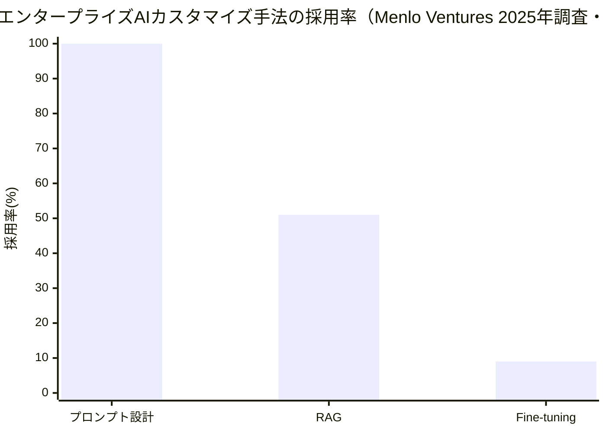
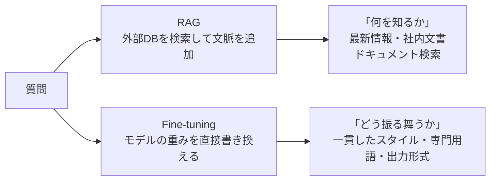
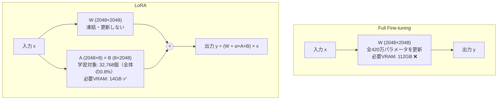
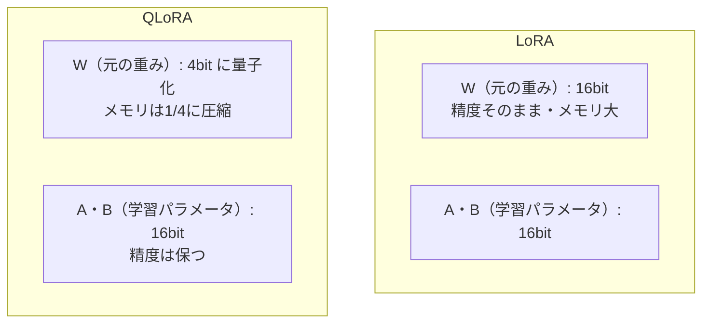
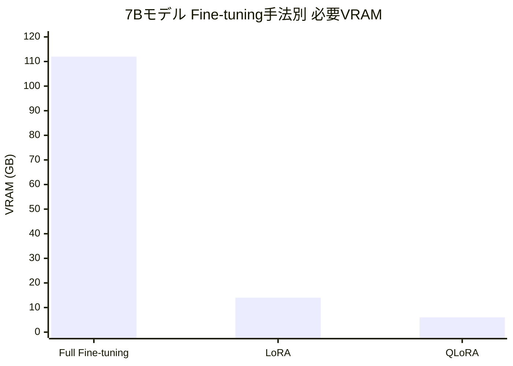
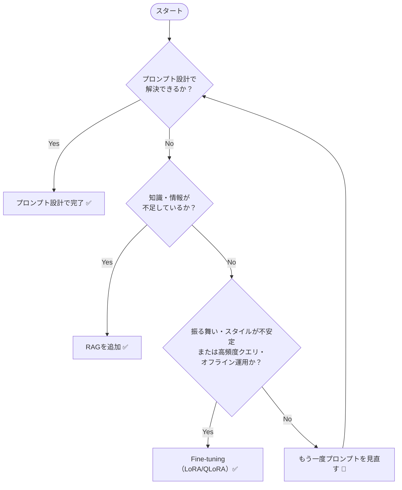

## はじめに

本記事では、Fine-tuningの中核技術であるLoRAとQLoRAの仕組みを図解で整理します。

実装は[AI初学者のためのRAG実装ガイド](https://zenn.dev/hkame/books/ai-architect-rag)の続編として、[pgvector-tutorial](https://github.com/qameqame/pgvector-tutorial)の `finetuning/` フォルダに含まれています。

---

## Fine-tuningの実際の立ち位置

まず「Fine-tuningはどれくらい使われているのか」という実態を確認しておきます。

Menlo Venturesが約500名の米国企業AI意思決定者を対象に実施した調査（2025年）によると、エンタープライズAIにおけるカスタマイズ手法の採用率は以下のとおりです。

| 手法 | 本番採用率 |
|------|----------|
| **プロンプト設計** | 最多（具体数値は非公開だが圧倒的1位） |
| **RAG** | 約51% |
| **Fine-tuning** | 約9% |

実態としての優先順位はこうなっています。



「まずプロンプトで済ます → 情報が足りなければRAGを追加 → それでも解決しない振る舞いの問題にのみFine-tuning」という優先順位です。Fine-tuningはフロンティアチームが使うニッチな技術であり、「RAGとFine-tuningのハイブリッドが標準」というのは現状の実態とは異なります。

**ではなぜFine-tuningを学ぶ必要があるのか？** Fine-tuningが9%にとどまるのはコストと複雑さゆえです。しかしLoRA・QLoRAの登場でそのコストは劇的に下がっており、Fine-tuningが必要な場面（後述）では確実に有効な手段です。

---

## Fine-tuningとRAGの役割分担

両者の違いを整理します。

| 技術              | 何を変えるか   | 向いている用途         |
| --------------- | -------- | --------------- |
| **RAG**         | モデルが見る情報 | 最新情報・社内ドキュメント検索 |
| **Fine-tuning** | モデルの振る舞い | 特定のスタイル・形式・専門用語 |



RAGは「何を知っているか」を扱い、Fine-tuningは「どう振る舞うか」を扱います。この2つは競合ではなく補完関係ですが、多くの問題はプロンプト設計かRAGで解決できます。Fine-tuningに踏み込むのは「プロンプトとRAGでは振る舞いを制御しきれない」と判断できた段階です。

---

## Full Fine-tuningの問題

通常のFine-tuning（Full Fine-tuning）は全パラメータを更新します。

```
7Bモデルのパラメータ数: 7,000,000,000個
Full Fine-tuning: 70億個全部を更新する
→ 必要VRAM: 112GB（RTX 4090は24GBなので不可能）
```

これが「Fine-tuningは高価なGPUが必要」と言われてきた理由です。

---

## LoRAの仕組み

LoRA（Low-Rank Adaptation）はこの問題を「低ランク行列の追加」で解決します。

### 核心的なアイデア

元の重み行列 **W**（例: 2048×2048 = 約420万パラメータ）を変更するのではなく、小さな2つの行列 **A** と **B** を追加してその積だけを学習します。



```
元のパラメータ: W（2048 × 2048 = 4,194,304個）
LoRAの追加分:  A（2048 × 8）+ B（8 × 2048）= 32,768個

削減率: 32,768 / 4,194,304 = 約0.8%
```

推論時は `出力 = (W + α×A×B) × 入力` として計算します。

```python
# train_lora.py の設定
lora_config = LoraConfig(
    task_type=TaskType.CAUSAL_LM,
    r=8,             # ランク（低ランク行列の次元）
    lora_alpha=32,   # スケーリング係数
    lora_dropout=0.1,
    target_modules=["q_proj", "v_proj"],  # Attention層に適用
)
```

### ランクの意味

`r` を大きくすると表現力が上がりますが、学習パラメータも増えます。

| r  | 特徴                  | 用途              |
| --- | ------------------- | --------------- |
| 4  | 最軽量・速い              | 実験・プロトタイプ       |
| 8  | バランス型（今回）           | 一般的なFine-tuning |
| 16 | 高精度                 | 精度重視            |
| 64 | Full Fine-tuningに近い | 大規模適応           |

---

## QLoRAの違い

QLoRAはLoRAに「4bit量子化」を追加したものです。



**7Bモデルの必要VRAM比較：**



---

## インプットデータの形式

LoRA/QLoRAのインプットは「正解例の質問と回答のペア」です。

```json
{
  "instruction": "F1スコアとは何ですか？",
  "input": "",
  "output": "F1スコアはPrecision（適合率）とRecall（再現率）の調和平均です。F1 = 2 × Precision × Recall ÷ (Precision + Recall) で計算します。"
}
```

これをAlpacaフォーマットと呼び、モデルは「この質問にはこういう形式・スタイルで答えるべき」というパターンを学習します。

**用途別のインプット例：**

| 用途        | インプット                |
| --------- | -------------------- |
| 社内FAQ特化   | 社内の質問→回答のログ          |
| カスタマーサポート | 過去の問い合わせ→対応文         |
| 日本語化      | 英語モデルに日本語Q&Aを学習させる   |
| コード生成     | 「〇〇するコードを書いて」→正しいコード |

**品質が命です。** データ量よりデータ品質が重要で、100件の高品質なデータは1000件の粗悪データより効果的です。

---

## 実行結果と読み方

LoRAはGPUがなくてもCPUで動きます。今回はApple Silicon（M5 Pro）搭載のMacBookで、GPU（MPS）を使わずあえてCPU実行を指定して試してみました。

今回の実装（phi-2・8件・CPU）での結果：

```
trainable params: 2,621,440 || all params: 2,782,305,280 || trainable%: 0.0942
```

全27億パラメータのうち学習したのは0.09%（260万個）のみです。これがLoRAの本質です。

```
eval_loss: 1.802 → 1.796 → 1.785（3エポック）
train_runtime: 109秒
```

eval_lossが下がっているので学習は正常に機能しています。ただし8件のデータでは実用的な品質向上には限界があります。100件以上から明確な改善が見え始めます。

---

## 速度比較（7Bモデル・Fine-tuning）

| 環境                        | 速度     | 備考               |
| ------------------------- | ------ | ---------------- |
| CPU（MacBook）              | 基準     | 数日〜1週間           |
| Apple Silicon M5 Pro（MPS） | 数倍     | 統合メモリが有利         |
| RTX 4090（CUDA）            | 10〜20倍 | 小〜中規模モデルでは最速     |
| A100（クラウド）                | 30〜50倍 | 本番Fine-tuningの標準 |

**7B・1000件のFine-tuningではRTX 4090がM5 Proより2〜3倍速い**のが現実です。Apple Siliconが逆転するのは70B以上の大きなモデルで、NVIDIAのVRAMに収まらない場合です。

実用的な選択肢として、RunpodやVastAIでRTX 4090を時間借り（$0.5〜1/時間）すると、数時間で7B・1000件のFine-tuningが完了します。

---

## 2026年のFine-tuningの位置づけ

LoRA・QLoRAの登場でFine-tuningのコストは劇的に下がりました。

```
2024年: 70Bモデルのファインチューニング → 6桁ドルのGPUコスト
2026年: QLoRA + 小型モデル(7B〜14B) → $10〜50のクラウドGPUで完結
```

ただし、コストが下がったからといってFine-tuningが標準的な選択肢になったわけではありません。Menlo Venturesの調査では2026年時点でもFine-tuningの本番採用率は9%にとどまっており、大半の企業はプロンプト設計とRAGで問題を解決しています。

Fine-tuningが有効なのは以下のケースに絞られます。



「振る舞いをどう変えたいか」が明確で、かつプロンプトとRAGでは解決できないと判断できた段階ではじめてFine-tuningを検討するのが現実的なアプローチです。

---

## まとめ

| 項目      | LoRA                    | QLoRA        |
| ------- | ----------------------- | ------------ |
| 元の重みの精度 | 16bit                   | 4bit（量子化）    |
| 学習する行列  | A・B（16bit）              | A・B（16bit）   |
| 必要メモリ   | LoRA < Full Fine-tuning | QLoRA < LoRA |
| CPU/GPU | どちらでも動く                 | どちらでも動く      |
| 主な用途    | VRAMに余裕がある場合            | VRAMが制限される場合 |

Fine-tuningは「モデルに何を覚えさせるか」よりも「モデルにどう振る舞わせるか」を変える技術です。知識の更新にはRAGが向いており、振る舞いの一貫性にはFine-tuningが向いています。ただし実務では、まずプロンプト設計で解決を試み、それでも不十分な場合にRAG、さらに振る舞いの制御が必要な場合にFine-tuningという順序で検討するのが合理的です。

---

## 参考

- [ソースコード: github.com/qameqame/pgvector-tutorial](https://github.com/qameqame/pgvector-tutorial)
- [Zenn本Vol.2: AIアーキテクトのための本番運用ガイド](https://zenn.dev/hkame/books/ai-architect-production)
- [LoRA論文（原著）](https://arxiv.org/abs/2106.09685)
- [QLoRA論文](https://arxiv.org/abs/2305.14314)
- [Hugging Face PEFT ドキュメント](https://huggingface.co/docs/peft)
- [Menlo Ventures: 2025 State of Generative AI in the Enterprise](https://menlovc.com/perspective/2025-the-state-of-generative-ai-in-the-enterprise/)
